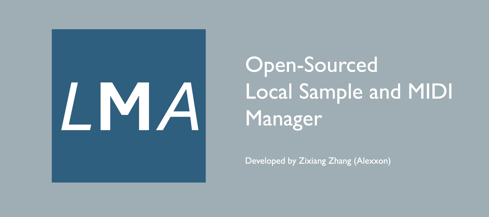
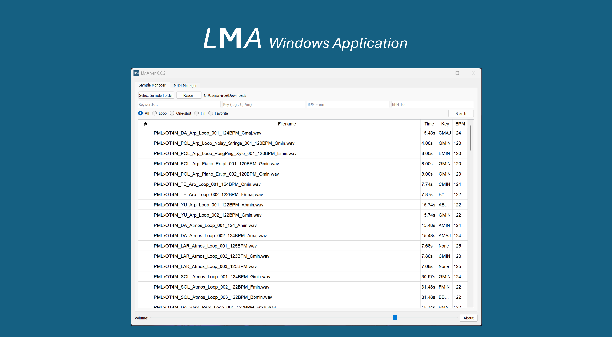
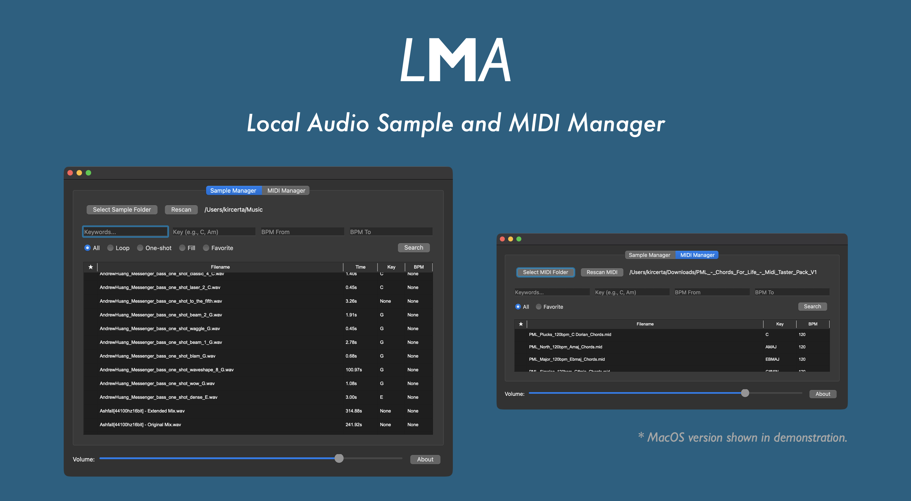
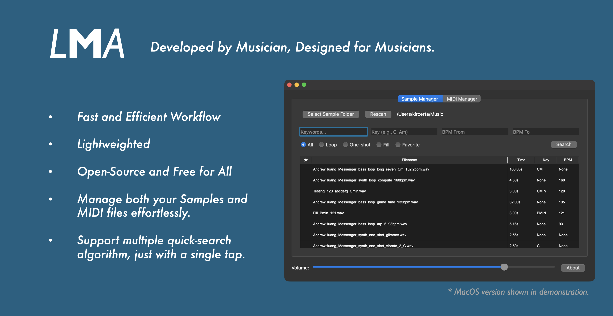
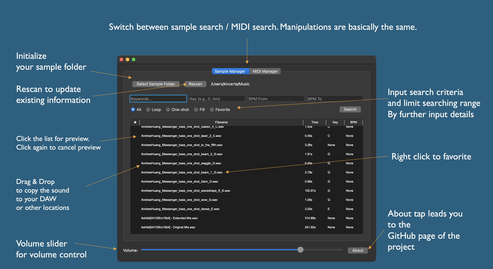

# LMA: An Open-Source Local Audio Sample Manager

Last Updated: Jan 10, 2026

> Repository Note (Feb 22, 2026): Git history was reset after a full architecture upgrade.  
> Please treat the latest `main` commits as the canonical source of truth.

---

Welcome. To download user executable file, please visit this [link](https://drive.google.com/drive/folders/1wAJiHze-FrULG5ajX_6uIGnapykya_nW?usp=drive_link).

For Chinese users: 中文用户指南与软件的下载，请参见[此链接](https://blog-kircertas-projects.vercel.app/zh/posts/developer/lma_chinese_userguide/)

---

This document contains a quick start guide for you. The picture references are based on the MacOS version of LMA. 

However, Windows version of LMA follows the exact same logic, except they look a bit different.

---

# Overview

# Features and Quick Start

# LMA Quick Start Guide

Thank you for using LMA (Working Title) Local Audio Sample Manager. I designed this light tool to help music creators retrieve and tag their local audio samples faster.

### Initialization

* Press "Select Folder" and choose the local sample folder and MIDI folder you wish to scan.
  * Notice that LMA require you to put your target files into one folder for each category.
* Press "Rescan" to perform a fresh scan of the samples or MIDIs within the folder.
  * When the amount of files are large, it may took a while for the scan to complete. Please wait until the process finish.

# Serching Samples/MIDIs

* Enter your search keywords in the Enter Keywords field, then click Search or press Enter to find samples.
  * Click on a sample that appears in the window below to preview the audio. Clicking it again will stop the playback.
  * MIDI preview in audio is not available. 
* Once a sample is selected, you can drag and drop it to your DAW or another location. The dragged sample will be copied to the new location.
  * Original sample being dragged will remain on its original location.
* You can choose to search for loop or one-shot samples.
  * Press the bullet list will perform a search with updated criteria immediately.
* You can search for samples within a specified BPM range.
  * If you enter the same number for both the start and end of the range, the search will switch to looking for an exact BPM match.
* You can search based on key of sample. But please be aware of the following rules:
  * Please note that LMA's search is based on file naming, not audio file analysis. 
  * Consequently, files with incorrect naming will not be actively identified, and users should be aware of this. 
  * Due to the complexity of naming and limitations, users must follow the syntax I have designed to conduct precise sample searches.
    * When searching for a major key, please search directly for the target note name (e.g., A).
      * The search results will include the major key, but may also contain other content. This will be explained later.
    * When searching for a minor key, such as A minor, please use this format: Am.
      * Inputting "Amin" or "Aminor" will cause search issues. This is because I have already standardized all equivalent expressions to ensure results point to the correct target.
      * Searches for other modes (e.g., Lydian, Dorian) can be performed in the Keywords section, or by searching for the major key equivalent and then browsing the results.

### Tagging
* Right-click on a sample to bring up the option: "Add to Collection."
  * Once selected, the sample will have a star icon next to it in the list.
  * Please note that tagging a sample does not change the file's original name, so you can use this feature worry-free.
* Sample classification and indexing are based on the file's original name.

### About
* About button will contain the current version information as well as the link to visit GitHub page of LMA.

---

# For Developers

As of Jan 10, 2026, LMA experienced an update. The update includes many changes, they will be documented below.

## Development Log (Current Cycle)

- **2026-02-22**: Unified key parsing/normalization for sample and MIDI indexing (`B`, `Bb`, `Am`, `Amin`, `Aminor` handling).
- **2026-02-22**: Changed key filter to canonical exact-match search to avoid flat/natural false positives.
- **2026-02-22**: Rescan now performs full index replacement to remove stale entries while preserving favorites for unchanged files.
- **2026-02-22**: Switched runtime data path to `~/Library/Application Support/LMA/` with legacy data migration.
- **2026-02-22**: Added SQLite tuning/indexes and key normalization tests.

LMA has been rewritten for performance and native compatibility. It is now built with **Python 3** (Tested on 3.9+) and uses the **PyQt6** framework.
**Core Tech Stack:**
* **PyQt6:** The modern standard for the GUI. It handles the windowing, event loop, and native integration.
* **SQLite3:** Replaced the old JSON indexing system. LMA now handles libraries with tens of thousands of samples with zero lag using a local SQL database.
* **QtMultimedia (PyQt6):** Replaced pygame. Audio playback is now handled natively by the OS via Qt, reducing dependency issues and size.
* **Threading (QThread):** File scanning and database operations run on background threads to keep the UI smooth.
* **soundfile:** Used to parse the duration of .wav files efficiently.

⠀**Code Layout:**
* **lma_main.py:** The main entry point. It initializes the QApplication, sets up the SQLite connection, manages the UI tabs, and handles the audio player logic.
* **sample_parser.py:** The parsing logic for **audio samples (.wav)**. It extracts metadata (BPM, Key, Type) from filenames and calculates duration.
* **midi_parser.py:** The parsing logic for **MIDI files (.mid)**. It extracts metadata using Regex from filenames.

⠀Data Location:
To comply with macOS/Windows standards and support read-only distribution (like DMGs), LMA now stores its database (lma_library.sqlite) and config (lma_config_v2.json) in the user's data directory:
* **macOS:** ~/Library/Application Support/LMA/
* **Windows:** %APPDATA%\LMA\

⠀Please let me know if you spot any bugs or have issues contributing to the code. Have fun!
